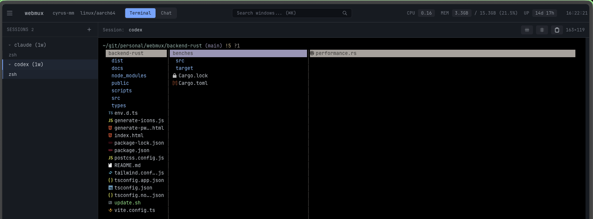

# WebMux



A high-performance web-based TMUX session viewer built with Rust and Vue.js. Access and control your TMUX sessions through a modern browser interface with full PWA support, WebSocket-based real-time communication, and mobile optimization.

## Features

- **Web-based Terminal**: Full terminal emulation in your browser using xterm.js
- **TMUX Session Management**: Create, attach, rename, and kill TMUX sessions
- **Window Management**: Create, switch, rename, and kill windows within sessions
- **Real-time Communication**: WebSocket-based architecture for live terminal I/O
- **Quick Search**: Fast window navigation with search functionality
- **Audio Streaming**: System audio capture and streaming (experimental)
- **Responsive Design**: Modern interface built with Vue 3 and Tailwind CSS
- **Performance Optimized**: Handles large outputs with buffering and flow control
- **PWA Support**: Install as a native app on mobile and desktop devices
- **HTTPS Enabled**: Secure connections with self-signed certificates
- **Mobile Optimized**: Touch-friendly interface with iOS safe area support
- **Network Accessible**: Access via local network or Tailscale IPs
- **Session Isolation**: Alternative session manager to avoid attachment conflicts

## Prerequisites

- Node.js (v14 or higher)
- npm or yarn
- Rust (latest stable version) - Install from [rustup.rs](https://rustup.rs/)
- cargo-watch (optional, for development) - Install with `cargo install cargo-watch`
- TMUX installed on your system
- ffmpeg (optional, for audio streaming)
- Modern web browser with WebSocket support

## Installation

1. Clone the repository:
```bash
git clone https://github.com/colerafiz/webmux.git
cd webmux
```

2. Install dependencies:
```bash
npm install
```

## Quick Start

### Development Mode

Run both the Rust backend and Vue frontend in development mode:
```bash
# HTTP mode (default)
npm run dev

# HTTPS mode (required for PWA and mobile features)
npm run dev:https
```

Development servers:
- Frontend: `http://localhost:5174` (development port)
- Backend: `http://localhost:4000` (HTTP) or `https://localhost:4443` (HTTPS)

### Production Mode

Build and run for production:
```bash
# Build both backend and frontend
npm run build

# Preview the production build
npm run preview
```

Production servers:
- Frontend: `http://localhost:5173`
- Backend: `http://localhost:3000` (HTTP) or `https://localhost:3443` (HTTPS)

### HTTPS Setup

Generate self-signed certificates for HTTPS:
```bash
npm run setup-certs
```

## Network Access

The application accepts connections from any network interface:
- **Local access**: `http://localhost:5174` (dev) or `http://localhost:5173` (prod)
- **Network access**: `http://[YOUR-IP]:5174` (e.g., `http://192.168.1.100:5174`)
- **Tailscale access**: `http://[TAILSCALE-IP]:5174` (e.g., `http://100.x.x.x:5174`)

## Installing as PWA

### iOS (iPhone/iPad)
1. Open Safari and navigate to the app (HTTPS required)
2. Tap the Share button (square with arrow)
3. Scroll down and tap "Add to Home Screen"
4. Name the app and tap "Add"

### Android
1. Open Chrome and navigate to the app (HTTPS required)
2. Tap the menu (three dots)
3. Tap "Add to Home Screen" or "Install App"
4. Follow the prompts to install

### Desktop Chrome
1. Look for the install icon in the address bar
2. Click "Install" when prompted

## Available Scripts

### Development
- `npm run dev` - Start both servers in development mode (HTTP)
- `npm run dev:https` - Start both servers with HTTPS enabled
- `npm run client` - Run only the frontend development server
- `npm run rust:dev` - Run only the backend with auto-restart

### Building
- `npm run build` - Build both backend and frontend for production
- `npm run rust:build` - Build only the Rust backend
- `npm run preview` - Preview the production build

### Testing & Quality
- `npm run rust:test` - Run Rust backend tests
- `npm run rust:check` - Run Rust code checks
- `npm run type-check` - Type-check frontend TypeScript
- `npm run lint` - Lint frontend code with ESLint

### Utilities
- `npm run setup-certs` - Generate self-signed SSL certificates

## Architecture

### Backend (Rust + Axum)
- **Web Framework**: Axum for high-performance async HTTP/WebSocket handling
- **Async Runtime**: Tokio for concurrent operations
- **Terminal Interface**: portable-pty for cross-platform PTY support
- **WebSocket**: tokio-tungstenite for real-time communication
- **Session Management**: Two approaches:
  - Direct attachment via `tmux attach-session`
  - Alternative manager using `send-keys` and `capture-pane` for better isolation
- **Audio Streaming**: FFmpeg integration for system audio capture

### Frontend (Vue 3 + TypeScript)
- **Framework**: Vue 3 with Composition API
- **Build Tool**: Vite for fast development and optimized builds
- **Terminal Emulator**: xterm.js with fit addon
- **Styling**: Tailwind CSS for responsive design
- **State Management**: @tanstack/vue-query for server state
- **WebSocket Client**: Native WebSocket API with reconnection logic

## API Reference

### WebSocket Protocol

All communication with the backend happens through WebSocket connections. There are no REST endpoints - everything is handled via real-time WebSocket messages.

Connect to `/ws` endpoint for terminal session management.

**Client → Server Messages:**
```javascript
// Session Management
{ type: 'list-sessions' }
{ type: 'create-session', name: string }
{ type: 'attach-session', sessionName: string, cols: number, rows: number }
{ type: 'kill-session', sessionName: string }
{ type: 'rename-session', sessionName: string, newName: string }

// Terminal I/O
{ type: 'input', data: string }
{ type: 'resize', cols: number, rows: number }

// Window Management
{ type: 'list-windows', sessionName: string }
{ type: 'create-window', sessionName: string, windowName?: string }
{ type: 'select-window', sessionName: string, windowIndex: number }
{ type: 'kill-window', sessionName: string, windowIndex: number }
{ type: 'rename-window', sessionName: string, windowIndex: number, newName: string }

// Audio Streaming
{ type: 'start-audio' }
{ type: 'stop-audio' }
```

**Server → Client Messages:**
```javascript
// Session Updates
{ type: 'sessions-list', sessions: Session[] }
{ type: 'session-created', session: Session }
{ type: 'session-killed', sessionName: string }
{ type: 'session-renamed', oldName: string, newName: string }
{ type: 'attached', sessionName: string }
{ type: 'disconnected' }

// Terminal Output
{ type: 'output', data: string }

// Window Updates
{ type: 'windows-list', windows: Window[] }
{ type: 'window-created', window: Window }
{ type: 'window-selected', windowIndex: number }
{ type: 'window-killed', windowIndex: number }
{ type: 'window-renamed', windowIndex: number, newName: string }

// Audio Streaming
{ type: 'audio-data', data: string }  // Base64 encoded audio
{ type: 'audio-status', streaming: boolean, error?: string }

// Real-time Updates (from monitor)
{ type: 'tmux-update', event: 'session-added' | 'session-removed' | 'window-added' | 'window-removed' }
```

## Troubleshooting

### Common Issues

**Keyboard input not working**
- Click anywhere in the terminal area to ensure it has focus

**Session not responding**
- Refresh the page and re-select the session from the list

**Window switching fails**
- Ensure you're attached to the session first

**Terminal freezes with large output**
- The system includes output buffering and flow control
- Check browser console for debug logs

**HTTPS certificate warnings**
- Accept the self-signed certificate in your browser
- For mobile devices, visit the backend URL directly first

### Debug Mode

Enable detailed logging:
```bash
RUST_LOG=debug npm run rust:dev
```

Enable audio streaming debug:
```bash
cd backend-rust && cargo run -- --audio
```

## Performance Considerations

- **Output Buffering**: Server buffers PTY output to prevent WebSocket overflow
- **Flow Control**: PTY pauses when WebSocket buffer is full
- **Client Batching**: Terminal writes are batched for smooth rendering
- **Session Isolation**: Alternative session manager available for better multi-client support

## Contributing

1. Fork the repository
2. Create your feature branch (`git checkout -b feature/amazing-feature`)
3. Commit your changes (`git commit -m 'Add some amazing feature'`)
4. Push to the branch (`git push origin feature/amazing-feature`)
5. Open a Pull Request

## Security Notes

- The application is designed for use on trusted networks
- HTTPS is recommended for production deployments
- Self-signed certificates are suitable for development/personal use
- Consider proper certificate management for public deployments

## License

This project is licensed under the MIT License - see the LICENSE file for details.

## Acknowledgments

- Terminal emulation by [xterm.js](https://xtermjs.org/)
- Backend powered by [Rust](https://www.rust-lang.org/) and [Axum](https://github.com/tokio-rs/axum)
- Frontend built with [Vue.js](https://vuejs.org/) and [Vite](https://vitejs.dev/)
- Styled with [Tailwind CSS](https://tailwindcss.com/)
- Real-time communication via [WebSocket](https://developer.mozilla.org/en-US/docs/Web/API/WebSocket)